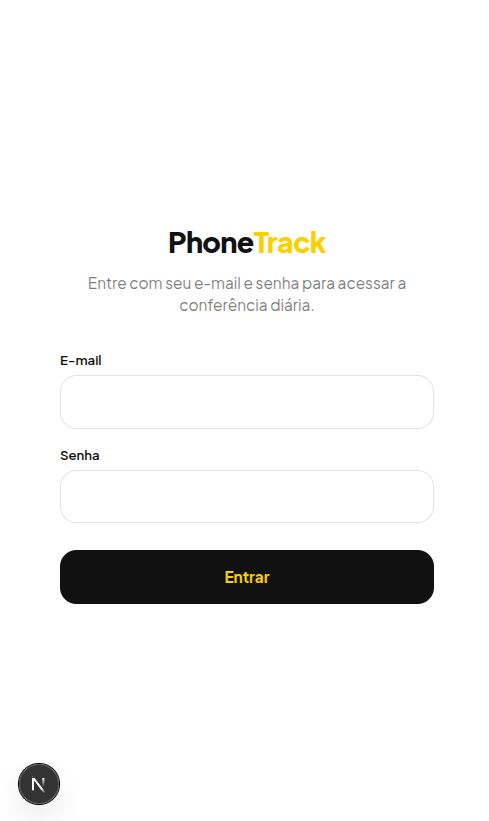
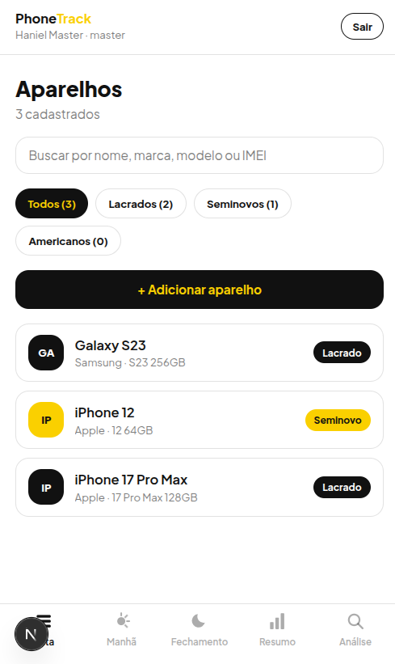
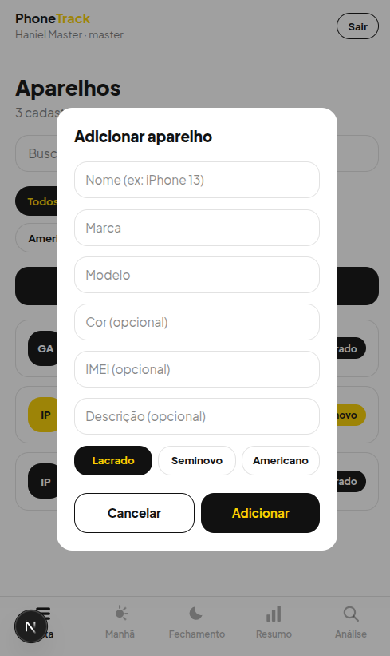
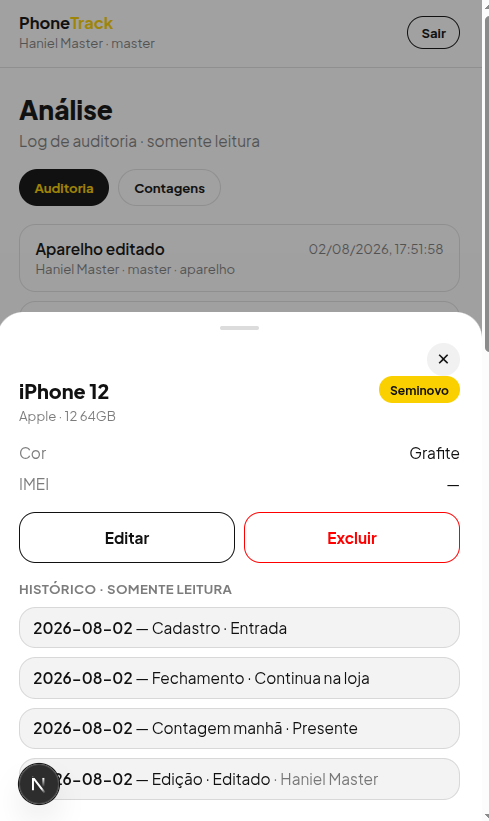
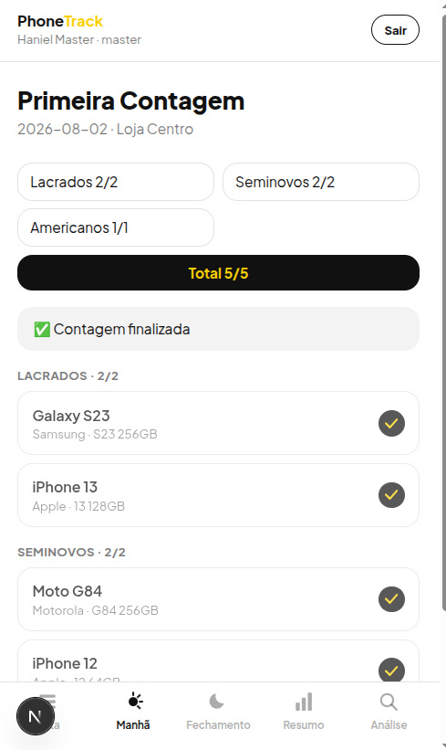
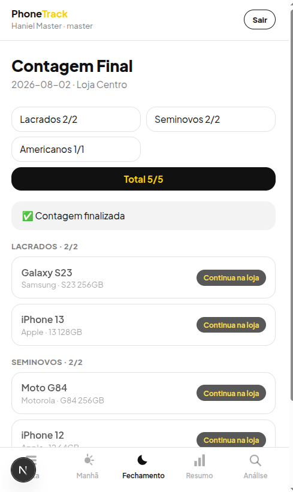
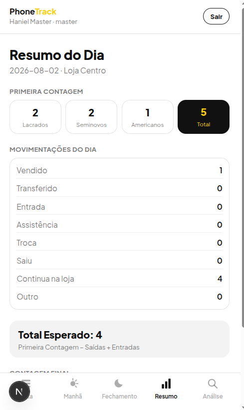
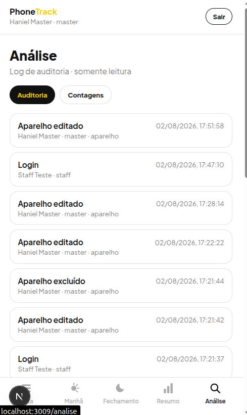
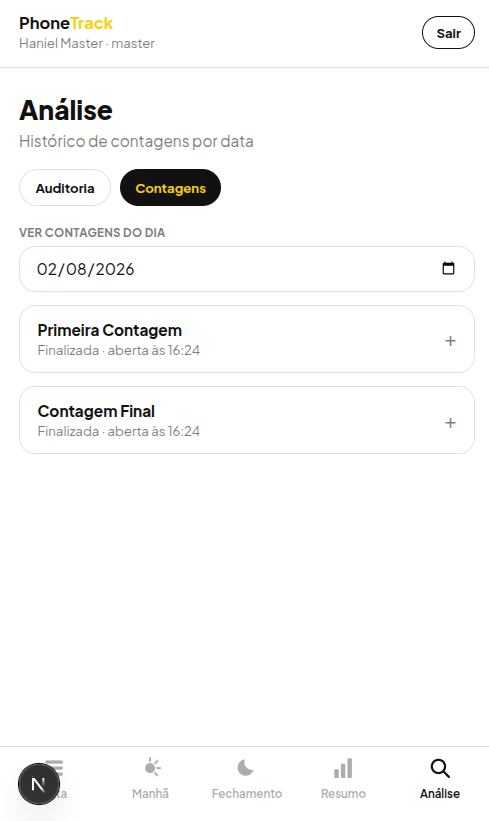
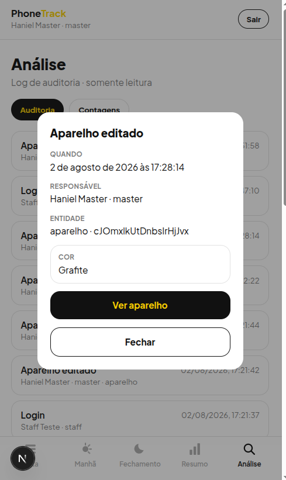

# PhoneTrack

Sistema para digitalizar a conferência diária de aparelhos de uma loja de celulares — hoje feita em caderno. Cobre o ciclo completo: cadastro de aparelhos, Primeira Contagem (abertura), Contagem Final (fechamento), bloqueio/resolução de pendências, resumo do dia calculado automaticamente e log de auditoria.

Ver [prd.md](prd.md) para a especificação funcional e o design original, e [ARQUITETURA.md](ARQUITETURA.md) para as decisões de arquitetura.

## Stack

- **Backend:** [NestJS](https://nestjs.com/) + [Firebase Admin SDK](https://firebase.google.com/docs/admin/setup) (Auth + Firestore)
- **Frontend:** [Next.js](https://nextjs.org/) (App Router, mobile-first) + [TanStack Query](https://tanstack.com/query)
- **Validação:** [Zod](https://zod.dev/), compartilhado entre backend e frontend via `packages/shared`
- **Monorepo:** npm workspaces

O Next.js só fala com a API Nest (exceto login, que usa o SDK client do Firebase Auth diretamente); toda regra de negócio, RBAC e auditoria fica centralizada no backend.

## Capturas de tela

<table>
<tr>
<td align="center"><br>Login</td>
<td align="center"><br>Lista de aparelhos</td>
</tr>
<tr>
<td align="center"><br>Adicionar aparelho</td>
<td align="center"><br>Ficha do aparelho (editar/excluir e histórico)</td>
</tr>
<tr>
<td align="center"><br>Primeira Contagem</td>
<td align="center"><br>Contagem Final</td>
</tr>
<tr>
<td align="center"><br>Resumo do Dia</td>
<td align="center"><br>Análise — log de auditoria</td>
</tr>
<tr>
<td align="center"><br>Análise — histórico de contagens por data</td>
<td align="center"><br>Análise — detalhe de um evento do log</td>
</tr>
</table>

## Estrutura

```
apps/
  api/       # NestJS — REST API
  web/       # Next.js — frontend
packages/
  shared/    # tipos, schemas (zod) e constantes compartilhados
```

## Rodando localmente

Pré-requisitos: Node.js, [Firebase CLI](https://firebase.google.com/docs/cli), Java (para os emuladores do Firestore).

```bash
npm install
```

Três processos, cada um em background:

```bash
npm run emulators   # Firebase (Auth/Firestore/Storage) — UI em http://localhost:4000
npm run dev:api      # Nest — http://localhost:3001 (health check em /health)
npm run dev:web      # Next.js — http://localhost:3009
```

Os dados do emulador persistem entre reinícios (`.emulator-data/`, local e gitignorado).

### Primeiro acesso

Sem usuário Master ainda não dá pra criar mais ninguém pela própria interface. Rode uma vez:

```bash
npm run seed:master --workspace apps/api -- <email> <senha> "<nome>"
```

## Papéis (RBAC)

- **Staff:** cadastra aparelhos, faz as contagens do dia a dia.
- **Admin:** tudo do Staff + edita/exclui aparelhos, desbloqueia pendências, vê o log de auditoria, gerencia usuários.
- **Master:** tudo do Admin + cria lojas e tem acesso a todas elas.

## Build

```bash
npm run build
```

Compila `packages/shared` antes de `apps/api` e `apps/web` (a API depende do pacote compilado, não do TypeScript-fonte).
